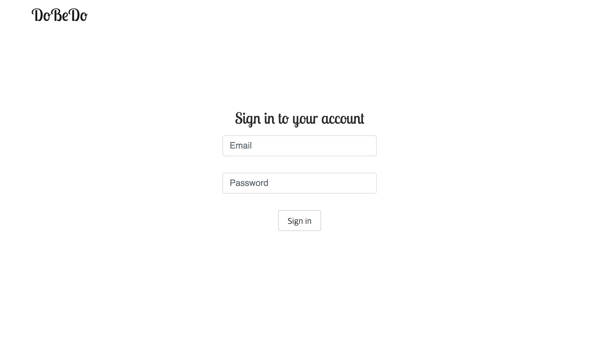
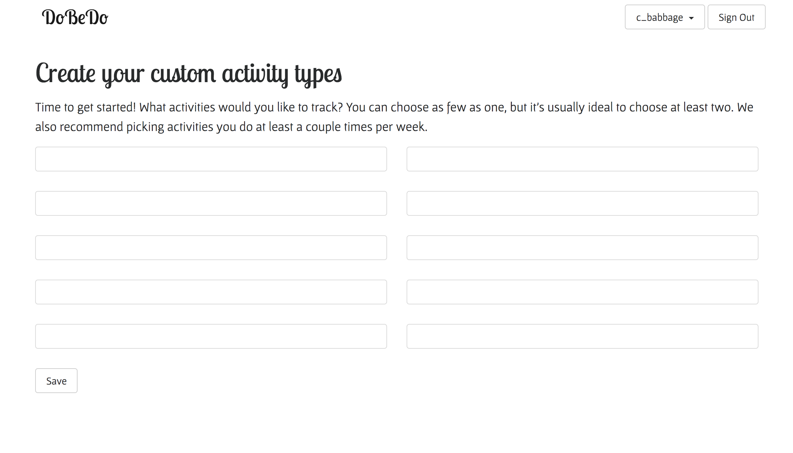
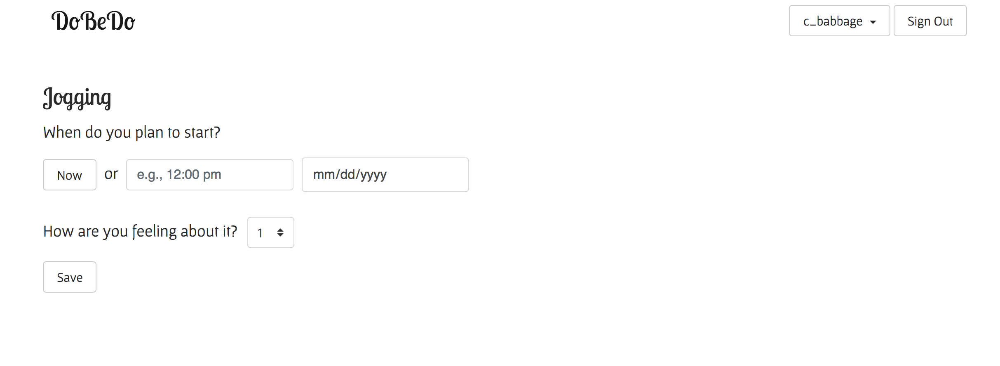
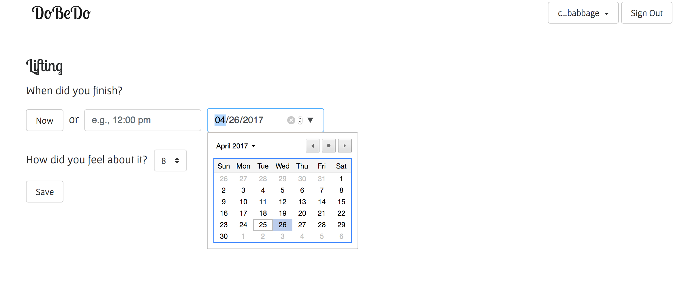
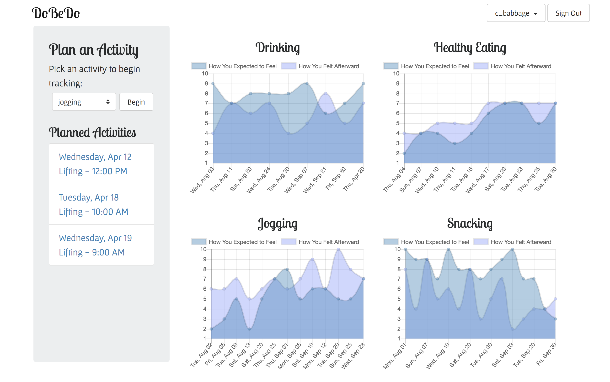

DoBeDo
===========

DoBeDo applies the notion of quantified self to the question of how to spend our
time if optimizing for happiness. Users track how they feel before and after
regular activities to better recognize which ones have the most positive impact 
on their mood. 

At signup, they select up to ten activities to track. Going forward, they record 
when they plan to do an activity and how they're feeling about doing it and, 
afterward, once they've done it, at what time they finished and how
they felt then. The app then provides a visualization of their expected and
actual sentiment toward all recorded occurrences of each activity over time. 
Also, if the user provides their phone number when signing up for an account, 
they receive an automated text message reminder if 24 hours have passed since
the stated starting time for a planned activity and they haven't yet recorded 
how they felt about it afterward.

#### Tech Stack

Python
Flask
Flask-SQLAlchemy
PostgreSQL
JavaScript
Bootstrap
jQuery
Jinja
Chart.js
Twilio API

#### Screenshots and Features

A user can create an account. Their password is hashed in the database, and
providing a phone number indicates they've opted in for text message reminders
about outstanding planned activities.

A user can indicate up to 10 activities to track.

A user can record what time they plan to start doing one of their activities and
how they're feeling about it at that time. They can also record, afterward, how
they actually felt when doing it and what time they finished.

A user can view charts showing expected and actual sentiments toward all 
occurrences of each activity they're tracking over time from the main page's
dashboard.

#### TODO

- Additional data viz or calendar integration leveraging duration data
- More tests!

#### About the Developer

Amber will be graduating soon from the full-stack software engineering 
fellowship at Hackbright Academy in San Francisco, CA. This is her first web 
application, and her favorite parts about building it were creating the data 
model, unbreaking (and sometimes re-breaking and then again unbreaking) things,
and coming to really appreciate the convenience and elegance provided by an ORM.

You can learn more here: www.linkedin.com/in/amberstaab/